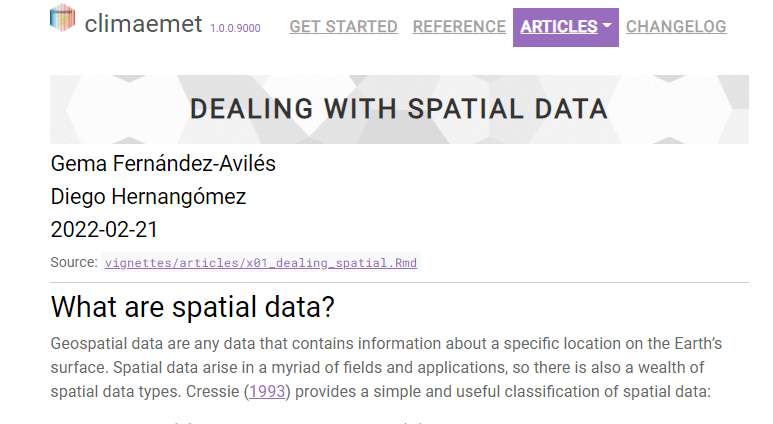

```{r setup, include = FALSE}
# opciones predeterminadas
options(htmltools.dir.version = FALSE)
knitr::opts_chunk$set(
  fig.width=9, fig.height=3.5, fig.retina=3,
  out.width = "60%",
  echo = TRUE,
  message = FALSE, 
  warning = FALSE,
  fig.show = TRUE,
  hiline = TRUE,
  fig.align = "center"
  )


```

---

<center>

</center>  

--- 


# [Pasos de un análisis geoestadístico con `gstat`]{style="color:blue"}


#### [Paso 1.]{style="color:red"} Leemos los datos y preparamos el entormno. Creamos un objeto de la clase `sf` (`st_as_sf`)

#### [Paso 2.]{style="color:red"} ¿Existe algún tipo de dependencia espacial? Análisis exploratorio de datos espaciales

#### [Paso 3.]{style="color:red"} ¿Cómo es la estructura de la dependencia espacial? Semivariograma empírico

#### [Paso 4.]{style="color:red"} ¿Es mi semivariograma válido? Ajuste del semivariograma empírico al semivariograma teórico

#### [Paso 5.]{style="color:red"} ¿Puedo hacer predicciones en sitios donde no tenga datos de la variable que analizo? Kriging. Predicción y Desviación típica del error de predicción

#### [Paso 6.]{style="color:red"} Evaluación y presentación de resultados. Valiación cruzada. Mapping. 


::: {style="background-color:orange; padding: 1rem 1rem 1rem 1rem;margin: 3rem 3rem 3rem 3rem;border-radius: 1rem;"}
***Nota***: 

Obsérvese que los pasos son idénticos en cualquier análisis geoestadístico, 
sea cual sea el programa o librería utilizados. Sólo cambia la estructura del objeto.

:::


---


# [Pasos de un análisis geoestadístico con `gstat`]{style="color:blue"}. 

### [Paso 1.]{style="color:red"} Leemos los datos y convertimos a clase `sf` 
```{r cod_datos, eval=FALSE}
library(sf)
# `mydata_sf` es un objeto espacial: $coords y $data
mydata_sf <- st_as_sf(mydata,
  coords = c("longitud", "latitud"),
  crs = el_que_corresponda
)
```

### [Paso 1.]{style="color:red"} Análisis exploratorio espacial de datos
```{r cod_eda, eval=FALSE}
summary(mydata_sf)
plot(mydata_sf["nombre_variable"])

# alternativa: 
ggplot() +
 geom_sf(
    data = mydata_sf,
    aes(color = nombre_variable)
  )
```

### [Paso 3.]{style="color:red"} Semivariograma empírico

```{r cod_sem_emp, eval=FALSE}
semivar_emp <- variogram(nombre_variable ~ 1, mydata_sf, cutoff = 1000000) 
plot(semivar_emp)
```

### [Paso 4.]{style="color:red"} [**Semivariograma teórico**]{style="color:red"}

```{r cod_sem_teo, eval=FALSE}
semivar_teo # contiene los parámetros del semivariograma teórico
vgm(psill = NA, model, range = NA, nugget=NA
```


```{r cod_inter, eval=FALSE}
* `model` = modelo de covarianza 
* `psill` = varianza parcial
* `range` = rango o alcance
* `nugget` = nugget
```


### [Paso 5.]{style="color:red"}. Kriging ordinario
```{r cod_grid, eval=FALSE}
# creamos una malla de interopolación
# Una grid 5*5 km (25 km2)
grd_sf <- st_bbox(esp_utm) %>%
  st_as_sfc() %>%
  st_make_grid(
    cellsize = 5000,
    what = "centers" 
  )
# Convert to sp object - interpolation should be made with sp/raster
grd <- as(grd_sf, "Spatial") %>%
  as("SpatialPixels")
```


```{r cod_krig, eval=FALSE}
# Kriging ordinario
# help(krige)
tmin_ok <- krige(tmin ~ 1,
  tmin_8enero_sp,
  grd_sf,
  model = tmin_vgm_fit  ## semivar. teórico
)
```


### [Paso 6.]{style="color:red"} Evaluación y presentación de resultados. Mapping
```{r cod_plots, eval=FALSE}  
#varias funciones de mapeado
contour(krig_ord, filled = TRUE)
image(krig_ord, val = krig_ord$krige.var) #superficie de varianzas

# validación cruzada
mygeodata_xv <- xvalid(mygeodata, model = semivar_teo)
```


```{r cod_3dplot, eval=FALSE}
library(plot3D)
# install.packages('plot3D')
persp3D(xx, yy, matrix(krig_ord$predict, nrow = length(xx)), theta=-60, phi=40)
```


---


# [Caso de estudio: Interpolación de la temperatura mínima en España mediante kriging ordinario]{style="color:green"}

Ejemplo tomado de **Pizarro M, Hernangómez D, Fernández-Avilés G (2021). *climaemet: Climate AEMET Tools*. doi: 10.5281/zenodo.5205573, http://hdl.handle.net/10261/250390**


```{r aemet, echo=FALSE, fig.cap="Climaemet"}


```


---

### [Paso 1.]{style="color:red"} Leemos los datos y convertimos a clase `sf`

```{r leo_datos, echo=TRUE}

# lectura de los datos y coordenadas
library(readr)
tmin <- read_csv("data/tempmin.csv")

# convertimos a un objeto sf
library(sf)
library(dplyr)

tmin_sf <- st_as_sf(tmin,
  coords = c("longitud", "latitud"),
  crs = 4258
)

tmin_8enero <- tmin_sf %>%
  filter(fecha == "2021-01-08")
```

---

### [Paso 2.]{style="color:red"} Análisis exploratorio de datos espaciales


```{r sum_co}
# descriptivos
summary(tmin_8enero)

# análisis gráfico
plot(tmin_8enero["tmin"],
  pch = 8
)
```


```{r tmin_geom, fig.cap="Temperatura mínima en España (8-enero-2022)"}
# Mapa de temperatura mínima con geometrías

library(mapSpain)
# sf object
esp2 <- esp_get_ccaa() %>%
  # No vamos a usar Canarias en este análisis
  filter(ine.ccaa.name != "Canarias")

# comprobamos CRS
st_crs(tmin_sf) == st_crs(esp2)


# Especificamos la paleta de color a utilizar
cortes <- c(-Inf, seq(-20, 20, 2.5), Inf)
colores <- hcl.colors(15, "PuOr", rev = TRUE)


library(ggplot2)
ggplot() +
  geom_sf(
    data = esp2,
    fill = "grey99"
  ) +
  geom_sf(
    data = tmin_8enero,
    aes(color = tmin),
    size = 4,
    alpha = .7
  ) +
  labs(color = "Temp. mín") +
  scale_color_gradientn(
    colours = colores,
    breaks = cortes,
    labels = function(x) {
      paste0(x, "º")
    },
    guide = "legend"
  ) +
  theme_light() +
  theme(
    plot.title = element_text(
      size = 12,
      face = "bold"
    ),
    plot.subtitle = element_text(
      size = 8,
      face = "italic"
    )
  )

```


---

### [Paso 3.]{style="color:red"} Comprobación de CRS y objeto espacial
#### `gstat::variogram()`
```{r}
tmin_8enero_utm <- st_transform(tmin_8enero, 25830)
esp_utm <- st_transform(esp2, 25830)
```


### [Paso 3.]{style="color:red"} Cálculo del semivariogram empírico
#### `gstat::variogram()`


```{r}
# Para la interpolación con gstat es necesarios cambiar a `sp`

library(sp)
tmin_8enero_sp <- as(tmin_8enero_utm, "Spatial")
tmin_8enero_sp <- st_as_sf(tmin_8enero_sp)
```


```{r co_sem_empirico, fig.width= 5}
# Directional empirical semivariogramin gstat()
library(gstat)
tmin_vgm_emp <- variogram(tmin ~ 1, tmin_8enero_sp, cutoff = 1000000)
tmin_vgm_emp 
plot(tmin_vgm_emp)
```


---

### [Paso 4.]{style="color:red"} Ajuste del semivariograma  empírico a uno teoríco (spherical)

#### [`geoR::eyefit()`]{style="color:red"}

```{r fit_wls}
tmin_vgm_fit <- fit.variogram(tmin_vgm_emp, # weighted least squares fit
  model = vgm(model = "Sph")  # vgm(psill = NA, model, range = NA, nugget=NA
)

tmin_vgm_fit
```


# Representa ambos semivariogramas (empírico y teórico)

```{r tmin_emp_teo, fig.width= 5, fig.cap="Semivariogramas empírico (puntos) y teórico (linea)"}
# Plot empirical (dots) and theoretical (line) semivariograms
plot(tmin_vgm_emp, tmin_vgm_fit)
```


---

### [Paso 5.]{style="color:red"}  Llevamos a cabo Kriging ordinario
##### gstat:: krige()
```{r tmin_teo_grid}
# creamos una malla de interopolación
# Una grid 5*5 km (25 km2)
grd_sf <- st_bbox(esp_utm) %>%
  st_as_sfc() %>%
  st_make_grid(
    cellsize = 5000,
    what = "centers" 
  )
# Convert to sp object - interpolation should be made with sp/raster
grd <- as(grd_sf, "Spatial") %>%
  as("SpatialPixels")
```


```{r tmin_teo_kriging}
# Kriging ordinario
tmin_ok <- krige(tmin ~ 1,
  tmin_8enero_sp,
  grd_sf,
  model = tmin_vgm_fit  ## semivar. teórico
)
```


---

### [Paso 6.]{style="color:red"}  Evaluación y presentación de resultados. Mapping
```{r raster_ok, echo=FALSE, include=FALSE}
# Convertimos de sf a SpatiaPixels
# Esto funciona porque nuestros puntos sf están espaciados regularmente

tmin_pixels <- tmin_ok %>%
  as("Spatial") %>%
  as("SpatialPixels")


library(raster)
# Creamos un ráster de nuestros pixels
rast_esp <- raster(tmin_pixels)
```


```{r co_krig, echo=FALSE, include=FALSE, fig.cap="Kriging ordinario de la tempratura mínima en España (8-enero-2022)"}
# Transferimos valores del objeto sf al ráster
rast_esp_ok_pred <- rasterize(
  tmin_ok,
  rast_esp,
  field = "var1.pred", ## valores de predicción ok
  fun = mean
)

# Además, podemos recortar el ráster a la forma de España

rast_esp_mask <- mask(rast_esp_ok_pred, esp_utm)

plot(rast_esp_mask, col = colores)
contour(rast_esp_ok_pred, add = TRUE)

```


```{r co_krig_sd, echo=FALSE, include=FALSE, fig.cap="Kriging ordinario de la tempratura mínima en España (8-enero-2022)"}

# Convertimos de sf a SpatiaPixels
# Esto funciona porque nuestros puntos sf están espaciados regularmente

# Transferimos valores del objeto sf al ráster
rast_esp_ok_var <- rasterize(
  tmin_ok,
  rast_esp,
  field = "var1.var", ## valores de varianza de predicción
  fun = mean
)

# Además, podemos recortar el ráster a la forma de España

rast_esp_mask_ok_var <- mask(rast_esp_ok_var, esp_utm)

plot(rast_esp_mask_ok_var, col = colores)
contour(rast_esp_ok_var, add = TRUE)

```


---

# Librerías R utilizadas

Cheng, J., Karambelkar, B. and Xie, Y. (2021). leaflet: Create Interactive Web Maps with
  the JavaScript 'Leaflet' Library. R package version 2.0.4.1.
  https://CRAN.R-project.org/package=leaflet

Hernangómez, D. (2021). mapSpain: Administrative Boundaries of Spain. R package version 0.2.3.
  http://doi.org/10.5281/zenodo.4318024. Package url: https://CRAN.R-project.org/package=mapSpain

Ribeiro, P., Diggle, P., Schlather, M., Bivand, R. and Ripley, R. (2020).
  geoR: Analysis of Geostatistical Data. R package version 1.8-1.
  https://CRAN.R-project.org/package=geoR

---

# ¿Dudas?

gema.faviles@uclm.es
---


```{r eval=FALSE, include=FALSE, message=FALSE, results='hide', echo=FALSE}
library(knitr)
knit('Slides_geor_v1.0.Rmd', tangle=TRUE)
source('Slides_geor_v1.0.R')
```
